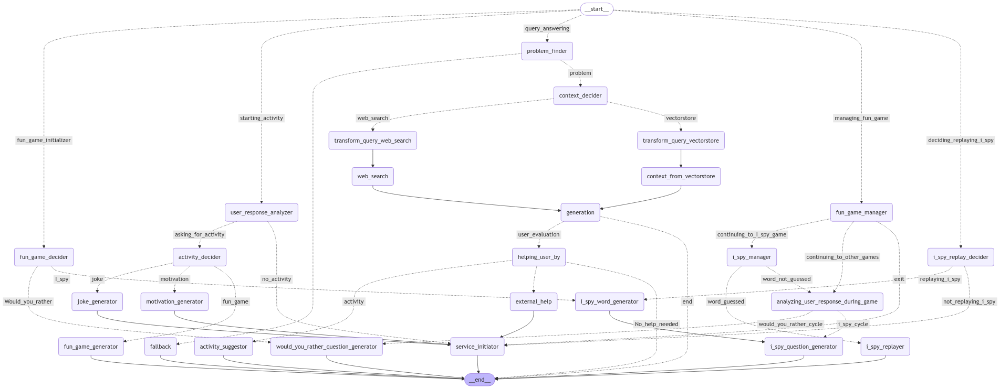

# CalmAcademia

**CalmAcademia** is a smart chatbot designed to help students cope with stress. It offers support for:

- **Exam Pressure**
- **Low Marks**
- **Family Pressure**
- **Performance Anxiety**
- **Homesickness**
- **Relationship Problems**
- **Money Issues**
- **Future Anxiety**

### Features:
- Personalized conversations to manage emotional and mental challenges.
- Practical advice and coping strategies.

### Flow-Graph


### Getting Started:
1. Clone the repository:
   ```bash
   git clone https://github.com/spiralMonster/CalmAcademia
   ```
2. Install dependencies:
   ```bash
   pip install -r requirements.txt
   ```
3. Run the chatbot:
   ```bash
   python3 main.py
   ```
